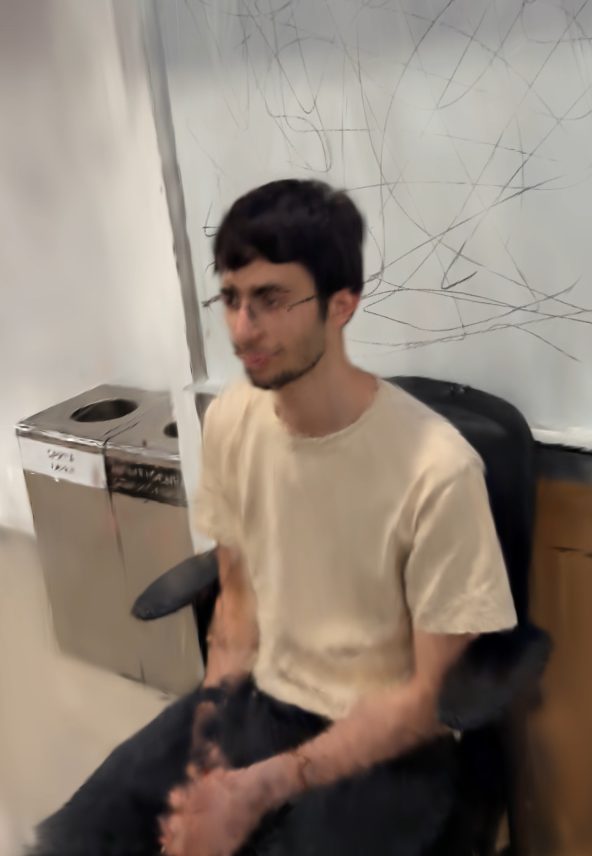
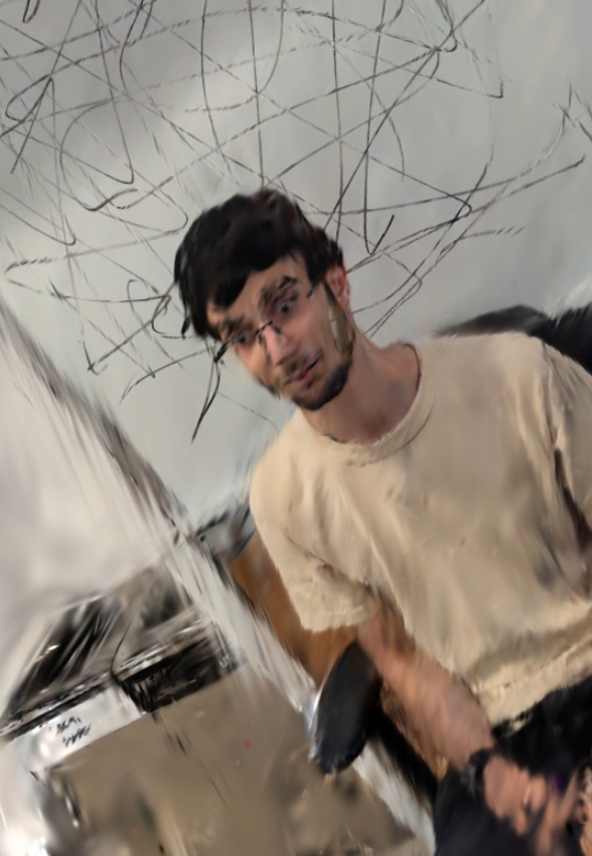
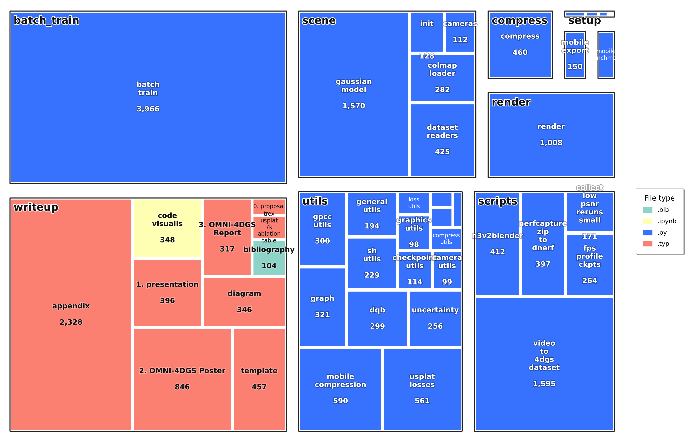

# Abstract

Dynamic scene reconstruction converts videos into compact, renderable 4D models. The dominant approach, Native 4D Gaussian Splatting is fast and effective but often suffers from Gaussian overgrowth, high VRAM use, large checkpoints, slow rendering, and fragile pruning or densification choices. OMNI-4DGS studies these quality-efficiency tradeoffs by jointly evaluating representation, rendering, and training decisions. We ablate covariance type, RGB versus 4DSH, rendering strategy, pruning schedules, ESS, dropout, and motion regularization across quality and efficiency metrics. Our best tested quality-compact preset improves visual quality while keeping model size compact, reaching 34.42 PSNR/29k Gaussians on _bouncingballs_ and 31.89 PSNR/81k on _trex_, improving the quality-compactness tradeoff for practical 4DGS deployment.

## Bouncing Balls ⚾

**Fixed:** No USplat/Prune/ESS/Dropout, Sort, 10k.

<table>
  <tr>
    <th></th>
    <th>Sort</th>
    <th>Sort-Free</th>
  </tr>
  <tr>
    <th>Ellipsoid</th>
    <td>
      
    </td>
    <td>
      
    </td>
  </tr>
  <tr>
    <th>Spherical</th>
    <td>
      
    </td>
    <td>
      
    </td>
  </tr>
</table>

## TRex 🐉

**Fixed:** No USplat/Prune/ESS/Dropout, Sort, 20k.

<table>
  <tr>
    <th></th>
    <th>SH(3)</th>
    <th>RGB</th>
  </tr>
  <tr>
    <th>Ellipsoid</th>
    <td>
      
    </td>
    <td>
      
    </td>
  </tr>
  <tr>
    <th>Spherical</th>
    <td>
      
    </td>
    <td>
      
    </td>
  </tr>
</table>

# MOG'D - Dataset

<table>
  <tr>
    <td align="center" width="50%">
      
       
      <strong>5 x Moving Cameras</strong>
    </td>
    <td align="center" width="50%">
      
       
      <strong>5 x Still Cameras</strong>
    </td>
  </tr>
</table>

# Conclusion

We presented *OMNI-4DGS*, a unified framework for fast, compact dynamic reconstruction built on Native 4D Gaussian Splatting, combining architectural choices from recent work into a single ablation study. Efficient 4DGS requires increasing expressiveness per Gaussian while controlling primitive growth: anisotropic covariance and SH(3) improve reconstruction quality; interleaved pruning and densification reduce Gaussian count, serialized model size, and VRAM, and a final one-shot prune further improves FPS at deployment. Dropout and the adapted sort-free renderer were not consistently beneficial across scenes. The *aniso · SH(3) · sort · ESS · interleaved prune · dropout* configuration achieved the best tested quality-compactness tradeoff on both `trex` and `bouncingballs`.

## Repository layout

| Path                         | Purpose                                                                    |
| ---------------------------- | -------------------------------------------------------------------------- |
| `train.py`                   | Train or resume a 4D Gaussian checkpoint.                                  |
| `render.py`                  | Render videos or image frames from a checkpoint.                           |
| `interactive_viewer.py`      | Open a real-time CUDA viewer for a checkpoint.                             |
| `batch_train.py`             | Generate, run, and evaluate ablation sweeps.                               |
| `compress.py`                | Simple checkpoint compression and round-trip validation.                   |
| `compression_postprocess.py` | Universal post-training compression, pruning, evaluation, and diagnostics. |
| `mobile_export.py`           | Export a Mobile-GS/NVQ compressed payload.                                 |
| `mobile_benchmark.py`        | Benchmark a Mobile-GS payload for size, FPS, and optional quality.         |
| `html_export.py`             | Build a local HTML overview of rendered ablation outputs.                  |
| `ablation_script.sh`         | Batch-render ablation checkpoints into consistently named videos.          |
| `scripts/`                   | Dataset conversion, FPS profiling, rerun helpers, and utility scripts.     |
| `configs/dnerf/`             | Standard D-NeRF scene configs.                                             |
| `configs/dnerf_ablation/`    | Clean baseline configs intended for ablation sweeps.                       |

## Setup and script guide

Information on how to run each script is in the [Guide File](guide.md).

## Reproducibility notes

For experiments intended for comparison:

1. Start with configs in `configs/dnerf_ablation/`.
2. Use explicit `--matrix-preset` and `--axes` choices.
3. Set `--seed` or `--seed-offset`.
4. Keep `--test_iterations` and `--save_iterations` consistent across rows.
5. Record the exact command and generated configs.
6. Prefer `chkpnt_best.pth` for final render/benchmark comparisons.
7. Use the same render mode, resolution, split, and temporal-mask settings when comparing FPS or visual quality.

# Code Visualization

# Feature Matrix

| Feature                          | 4DGS-1K / 1000FPS | Instant4D | MobileGS | DropoutGS | USplat4D | Code reference                                                                                                                                                                                                                                                                                                                                                                                                  |
| -------------------------------- | ----------------- | --------- | -------- | --------- | -------- | --------------------------------------------------------------------------------------------------------------------------------------------------------------------------------------------------------------------------------------------------------------------------------------------------------------------------------------------------------------------------------------------------------------- |
| Gaussians   4D                | ✓                 | ✓         | ✓        | ✓         | ✓        | **Current-only mode.** [`GaussianModel.__init__`](scene/gaussian_model.py#L198-L244), [`training guard`](train.py#L630-L638), [`render guard`](gaussian_renderer/__init__.py#L159-L174)                                                                                                                                                                                                                         |
| Gaussians   3D                |                   |           |          |           |          | **Not supported as a train/render mode.** [`--gaussian_dim choices=[4]`](train.py#L1924-L1924), [`GaussianModel` guard](scene/gaussian_model.py#L224-L226)                                                                                                                                                                                                                                                      |
| Gaussians   Quaternion        | ✓                 |           | ✓        | ✓         | ✓        | **Existing / reused.** [`get_rotation`](scene/gaussian_model.py#L372-L385), [`build_rotation_4d`](utils/general_utils.py#L113-L133)                                                                                                                                                                                                                                                                             |
| Gaussians   Rotation Matrix   |                   |           |          |           |          | **Derived only, not optimized as parameters.** [`build_rotation`](utils/general_utils.py#L79-L100), [`build_rotation_4d`](utils/general_utils.py#L113-L133)                                                                                                                                                                                                                                                     |
| Gaussians   Isotropic         |                   | ✓         |          |           |          | **Existing / adapted.** [`isotropic_gaussians`](scene/gaussian_model.py#L198-L244), [`get_scaling`](scene/gaussian_model.py#L357-L361), [`_apply_isotropic_parameterization`](scene/gaussian_model.py#L392-L412), [`Instant4D preset`](batch_train.py#L913-L924)                                                                                                                                                |
| Gaussians   Anisotropic       | ✓                 |           | ✓        | ✓         | ✓        | **Existing / default.** [`get_scaling`](scene/gaussian_model.py#L357-L361), [`build_scaling_rotation`](utils/general_utils.py#L102-L111), [`build_scaling_rotation_4d`](utils/general_utils.py#L135-L145), [`clean method defaults`](batch_train.py#L872-L898)                                                                                                                                                  |
| Gaussians   RGB               |                   | ✓         |          |           |          | **Existing / preset-driven.** [`RGB2SH`](utils/sh_utils.py#L225-L226), [`create_from_pcd`](scene/gaussian_model.py#L484-L555), [`Instant4D RGB override`](batch_train.py#L913-L924)                                                                                                                                                                                                                             |
| Gaussians   SH(1)             |                   |           | ✓        |           |          | **Existing / MobileGS-style.** [`_first_order_features`](utils/mobile_compression.py#L65-L84), [`MobileGS preset`](batch_train.py#L955-L964), [`capture_mobile_payload`](utils/mobile_compression.py#L241-L348)                                                                                                                                                                                                 |
| Gaussians   SH(3)             | ✓                 |           |          | ✓         | ✓        | **Existing / native 4DGS appearance.** [`sh_degree = 3`](arguments/__init__.py#L54-L70), [`get_max_sh_channels`](scene/gaussian_model.py#L436-L441), [`eval_shfs_4d`](utils/sh_utils.py#L115-L223)                                                                                                                                                                                                              |
| Init   Random                 | ✓                 | ✓         | ✓        | ✓         | ✓        | **Existing.** [`readNerfSyntheticInfo`](scene/dataset_readers.py#L312-L384), [`create_from_pcd`](scene/gaussian_model.py#L484-L555)                                                                                                                                                                                                                                                                             |
| Init   MegaSAM                |                   |           |          |           |          | **Not found in repo.**                                                                                                                                                                                                                                                                                                                                                                                          |
| Compress   MLP / Distillation |                   |           | ✓        |           |          | **Implemented for MobileGS sort-free runs.** [`MobileOpacityPhiNN`](scene/gaussian_model.py#L85-L134), [`MobileGS teacher loading`](train.py#L116-L139), [`distillation setup`](train.py#L717-L729), [`MobileGS training overrides`](batch_train.py#L1218-L1271)                                                                                                                                                |
| Compress   K-means / NVQ      |                   |           | ✓        |           |          | **Implemented.** [`_run_kmeans`](utils/mobile_compression.py#L131-L159), [`nvq_encode_tensor`](utils/mobile_compression.py#L162-L209), [`mobile_export.py`](mobile_export.py#L93-L103)                                                                                                                                                                                                                          |
| Compress   Spatial GPCC       |                   |           | ✓        |           |          | **Implemented.** [`voxelize`](utils/gpcc_utils.py#L79-L88), [`compress_gpcc`](utils/gpcc_utils.py#L250-L262), [`capture_mobile_payload`](utils/mobile_compression.py#L241-L348)                                                                                                                                                                                                                                 |
| Train   Uncertainty           |                   |           |          |           | ✓        | **Re-implemented for USplat4D.** [`compute_uncertainty_single_frame`](utils/uncertainty.py#L76-L155), [`compute_uncertainty_all_frames`](utils/uncertainty.py#L159-L215), [`rebuild_usplat_state`](train.py#L584-L628)                                                                                                                                                                                          |
| Train   Batch in Time         | ✓                 |           |          |           |          | **Existing / global training support.** [`DataLoader batch_size`](train.py#L805-L827), [`batch loop`](train.py#L830-L835)                                                                                                                                                                                                                                                                                       |
| Train   Voxelization          |                   |           | ✓        |           | ✓        | **Implemented in MobileGS compression and USplat graphing.** [`voxelize`](utils/gpcc_utils.py#L79-L88), [`build_graph voxel candidates`](utils/graph.py#L145-L177)                                                                                                                                                                                                                                              |
| Prune   Contribution          | ✓                 |           | ✓        |           |          | **Implemented.** [`render gaussian_scores`](gaussian_renderer/__init__.py#L521-L542), [`compute_spatio_temporal_variation_score`](scene/gaussian_model.py#L785-L852), [`generic_contribution_scores`](compression_postprocess.py#L495-L509), [`prune_generic_contribution`](compression_postprocess.py#L582-L610)                                                                                               |
| Prune   Gradient Loss         | ✓                 | ✓         | ✓        | ✓         | ✓        | **Existing base density-control path.** [`add_densification_stats`](scene/gaussian_model.py#L1337-L1348), [`densify_and_prune`](scene/gaussian_model.py#L1292-L1335), [`training densification call`](train.py#L1394-L1437)                                                                                                                                                                                     |
| Prune   Spatio-Temporal       | ✓                 |           |          |           |          | **Re-implemented.** [`compute_spatio_temporal_variation_score`](scene/gaussian_model.py#L785-L852), [`prune_with_spatio_temporal_score`](scene/gaussian_model.py#L883-L965), [`scheduled ST pruning`](train.py#L1502-L1541)                                                                                                                                                                                     |
| Prune   Opacity               | ✓                 | ✓         |          | ✓         | ✓        | **Existing for sorted rendering; disabled for sort-free MobileGS.** [`thresh_opa_prune`](arguments/__init__.py#L113-L114), [`densify_and_prune`](scene/gaussian_model.py#L1292-L1335), [`sort-free opacity-prune guard`](train.py#L1421-L1430)                                                                                                                                                                  |
| Prune   One-shot              | ✓                 |           |          |           |          | **Implemented as pruning option.** [`final_prune_from_iter`](arguments/__init__.py#L121-L122), [`densify_then_prune_once registry`](batch_train.py#L819-L826), [`final ST prune`](train.py#L1594-L1617)                                                                                                                                                                                                         |
| Prune   Scheduled             | ✓                 |           |          |           |          | **Implemented as pruning option / paper preset.** [`interleaved_prune_densify registry`](batch_train.py#L827-L840), [`scheduled pruning loop`](train.py#L1508-L1541)                                                                                                                                                                                                                                            |
| Prune   Densify               | ✓                 | ✓         | ✓        | ✓         | ✓        | **Existing base Gaussian densification.** [`densify_and_split`](scene/gaussian_model.py#L1065-L1153), [`densify_and_clone`](scene/gaussian_model.py#L1249-L1290), [`training densification call`](train.py#L1394-L1437)                                                                                                                                                                                         |
| Prune   Edge-guided Split     |                   |           |          | ✓         |          | **Re-implemented DropoutGS ESS-style split.** [`build_ess_registry`](batch_train.py#L101-L135), [`compute_edge_guided_split_mask`](train.py#L220-L293), [`split_points_by_mask`](scene/gaussian_model.py#L1156-L1247), [`ESS schedule`](train.py#L1551-L1592)                                                                                                                                                   |
| Prune   Dropout               |                   |           |          | ✓         |          | **Re-implemented DropoutGS RDR.** [`random_dropout_prob`](arguments/__init__.py#L83-L91), [`build_dropout_registry`](batch_train.py#L86-L98), [`render dropout mask`](gaussian_renderer/__init__.py#L377-L399), [`RDR loss`](train.py#L957-L985)                                                                                                                                                                |
| Render   Visibility Mask      | ✓                 |           | ✓        |           |          | **Re-implemented 4DGS-1K-style export/inference mask.** [`build_temporal_visibility_filter`](utils/mobile_compression.py#L450-L535), [`attach_temporal_visibility_filter`](utils/mobile_compression.py#L538-L553), [`_select_temporal_active_mask`](gaussian_renderer/__init__.py#L85-L156), [`mobile_export`](mobile_export.py#L79-L103)                                                                       |
| Render   Sort-based           | ✓                 | ✓         |          | ✓         | ✓        | **Existing sorted alpha blending.** [`sorted render path`](gaussian_renderer/__init__.py#L249-L270), [`duplicateWithKeys`](diff-gaussian-rasterization/cuda_rasterizer/rasterizer_impl.cu#L72-L113), [`SortPairs`](diff-gaussian-rasterization/cuda_rasterizer/rasterizer_impl.cu#L340-L345)                                                                                                                    |
| Render   Sort-free            |                   |           | ✓        |           |          | **Heavily modified MobileGS-style OIT path.** [`sort_free_render`](gaussian_renderer/__init__.py#L212-L247), [`MobileGS opacity/phi render`](gaussian_renderer/__init__.py#L472-L539), [`duplicateWithTileKeys`](diff-gaussian-rasterization-ms-nosorting/cuda_rasterizer/rasterizer_impl.cu#L128-L166), [`OIT kernels`](diff-gaussian-rasterization-ms-nosorting/cuda_rasterizer/rasterizer_impl.cu#L458-L929) |

# References

- [4DGS Native / 4D Gaussian Splatting](https://github.com/fudan-zvg/4d-gaussian-splatting): base 4DGS training/rendering pipeline and dynamic-scene representation.

  - [3D Gaussian Splatting](https://github.com/graphdeco-inria/gaussian-splatting): original 3DGS utilities and base Gaussian-splatting components.
  - [diff-gaussian-rasterization](https://github.com/graphdeco-inria/diff-gaussian-rasterization): CUDA Gaussian rasterizer.
  - [simple-knn](https://gitlab.inria.fr/bkerbl/simple-knn): KNN CUDA extension used by Gaussian-splatting code.
  - [Stratified-Transformer / pointops2](https://github.com/JIA-Lab-research/Stratified-Transformer): point cloud CUDA utility ops.

- [Mobile-GS](https://github.com/xiaobiaodu/Mobile-GS): mobile-oriented Gaussian compression / pruning / rendering optimizations.

  * [mpeg-pcc-tmc13](https://github.com/MPEGGroup/mpeg-pcc-tmc13): MPEG GPCC point-cloud compression backend.

- [DropoutGS](https://github.com/xuyx55/DropoutGS): dropout-based Gaussian pruning/compression ideas.

- [Instant4D](https://github.com/Zhanpeng1202/Instant4D): lightweight 4DGS pruning / isotropic Gaussian / fast dynamic-scene optimization ideas.

- [4DGS-1K / 1000FPS 4DGS](https://github.com/4DGS-1K/4DGS-1K.github.io): 1000+ FPS 4DGS project reference and performance-oriented design ideas.

- [USplat4D](https://github.com/cywhitebear/usplat4d): unified/static-dynamic 4D Gaussian splatting reference implementation.

- [stb](https://github.com/nothings/stb): vendored image-writing utility, e.g. `stb_image_write.h`.
